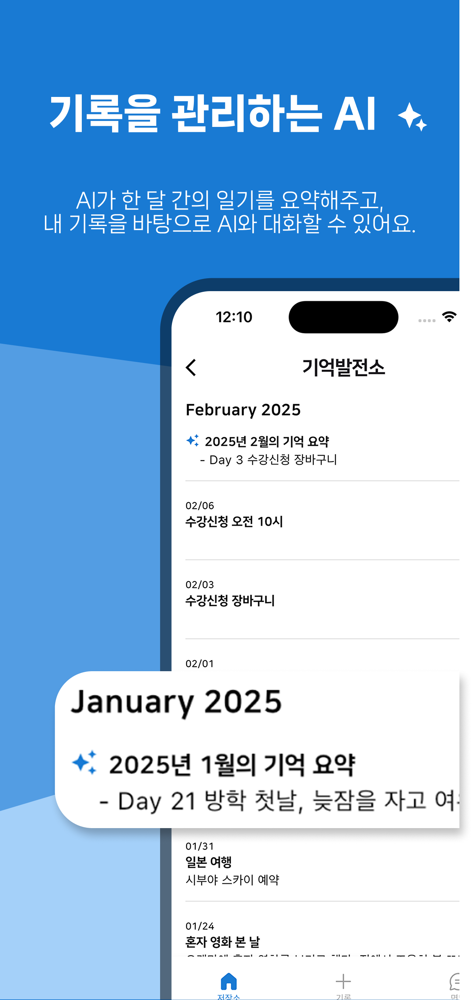
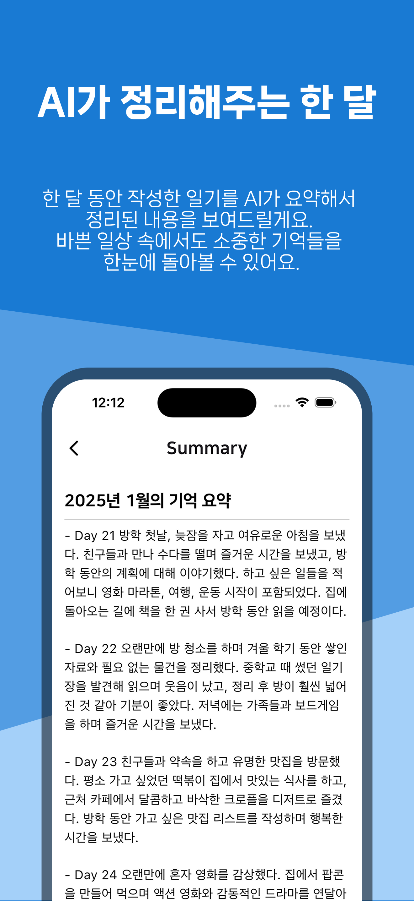
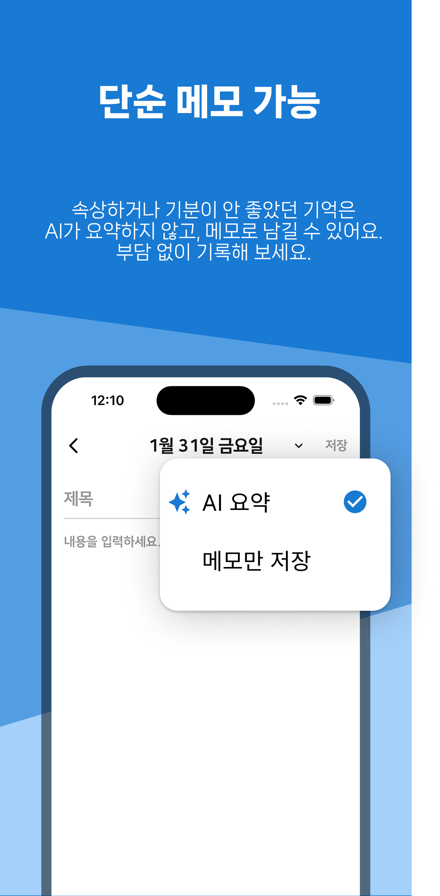
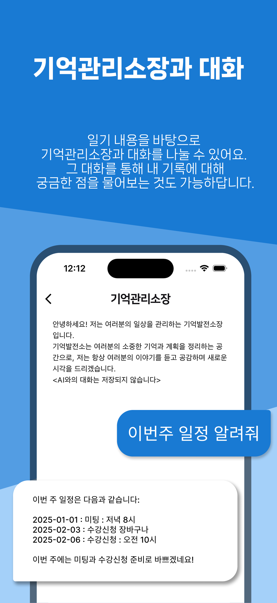
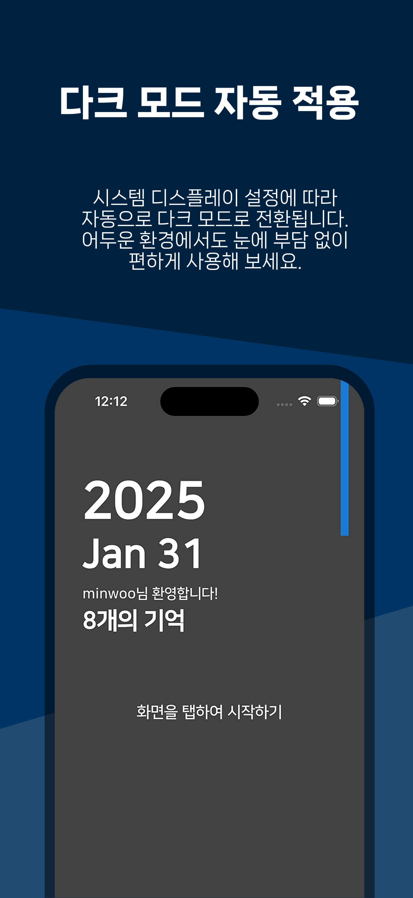

# Memory Plant

I created **Memory Plant**, an AI-powered journaling app that helps users organize their personal stories from diary entries.  
Users keep their “Memory Plant” factory running by writing daily journals, while the AI “Memory Curator” summarizes entries and serves as a conversational partner.  
Each month, the app generates a personalized summary scrapbook and offers tailored suggestions based on users’ recorded memories.

## Screenshots

<p align="center">
  
  
  
</p>

<p align="center">
  
  
</p>


## Key Features
- Email/password authentication  
- Google and Apple Sign-In support for easy and secure login  
- Light and Dark mode support for comfortable viewing  
- Bilingual support: English and Korean  
- AI-powered journaling using Cohere language model integration

## Tech Stack
- Flutter
- Firebase
- Provider
- Google Mobile Ads (for banner ads)

## Project Structure
```
lib/
└──screens/      # Contains UI for each major screen such as login, home, and settings
└──widgets/      # Includes reusable UI elements like buttons, cards, and lists
└──styles/       # Manages design-related settings like colors, themes
```
## Getting Started
You can download the app here:
[Google Play Store](https://play.google.com/store/apps/details?id=com.minwoos22.memoryplantapplication&pcampaignid=web_share)
[Apple App Store](https://lnkd.in/ehTyaRcu)

This project is the collective creation of our team. Unauthorized use or reproduction is prohibited without prior permission. Please reach out to us for any inquiries.
